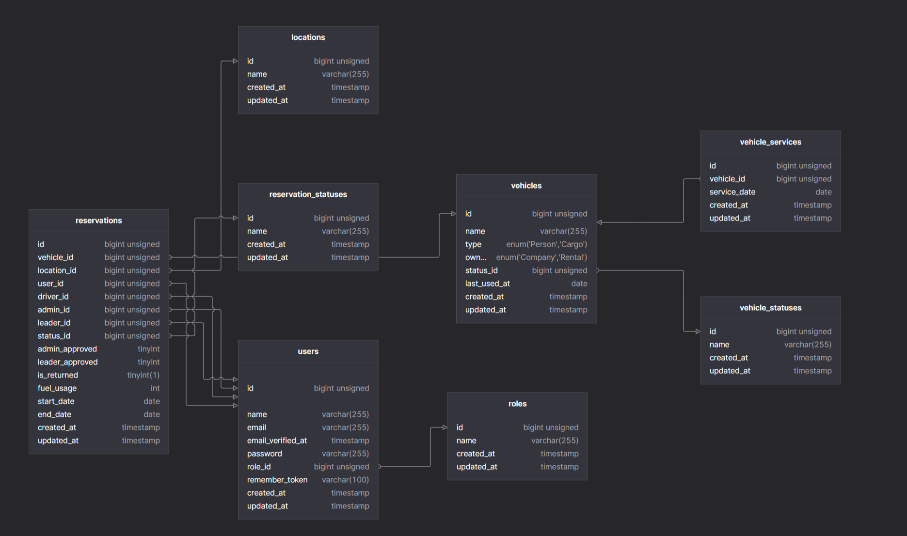
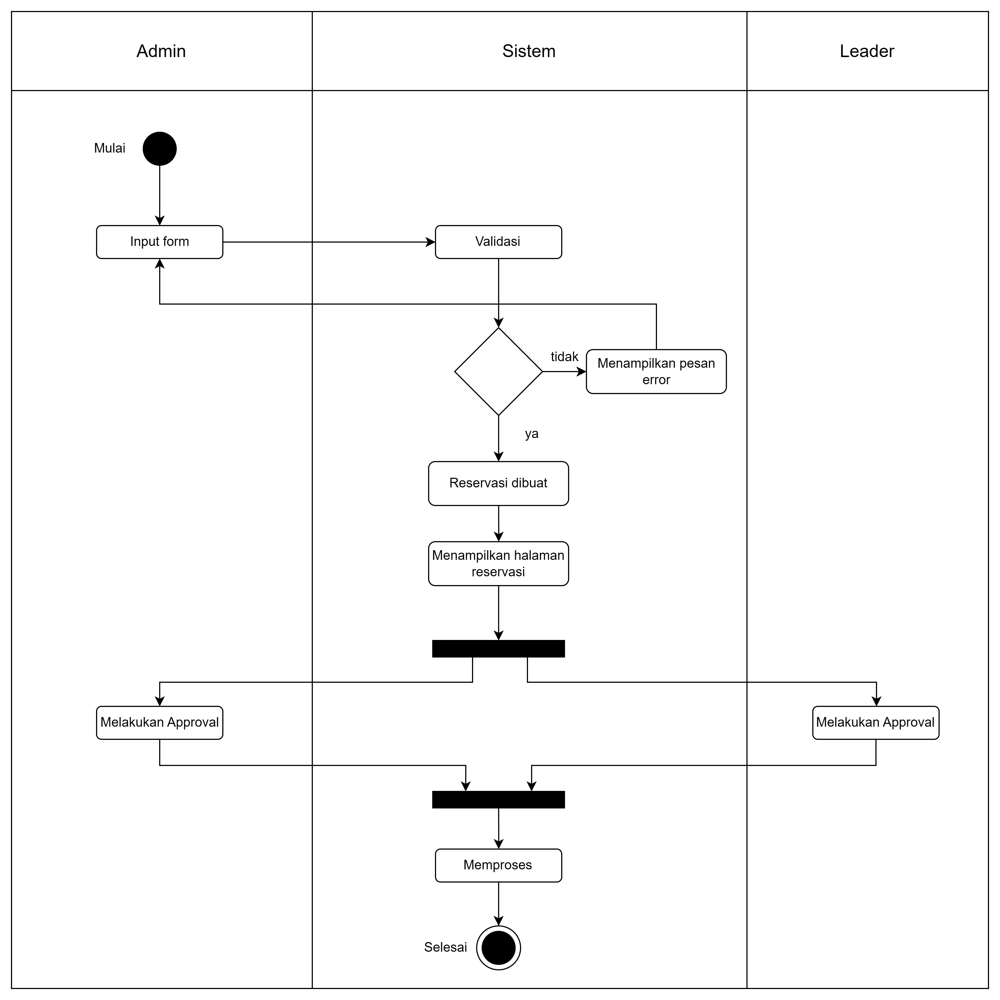

<p align="center"><a href="https://laravel.com" target="_blank"></a></p>

Stack | Tech | Version | 
--- | --- | --- |
🐘 PHP | PHP | 8.2.22
🛢  Database | MySQL | 8.0.30 | 
🛠️ Framework | Laravel | 11 |

### ⚙️ System Requirements

#### Physical Data Model


#### Activity Diagram


1. Clone this project
```zsh
git clone https://github.com/HansAndi/mining-test.git
```

2. Change directory to project
```zsh 
cd mnining-test
```

3. Install required dependancies
```zsh
composer install
```

4. Copy the env file
```zsh
cp .env.example .env
```

5. Generate application key and run the migrations
```zsh
php artisan key:generate
php artisan migrate --seed
```

6. Run the application
```
php artisan serve
```

7. Open the application at [http://localhost:8000](http://localhost:8000)

8. Use these login credentials to access the application

Email | Password | Role | 
--- | --- | --- |
admin@admin.com | password | Admin |
leader@leader.com | password | Leader | 
